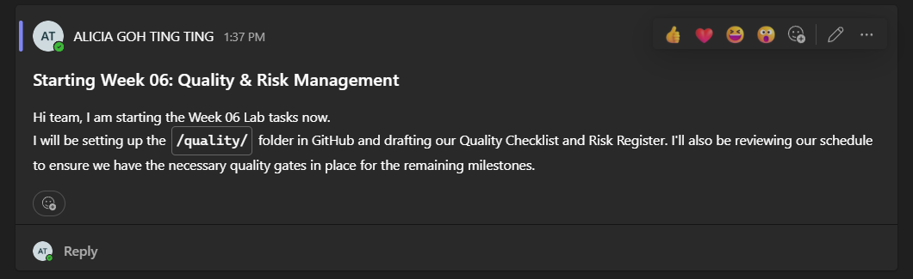
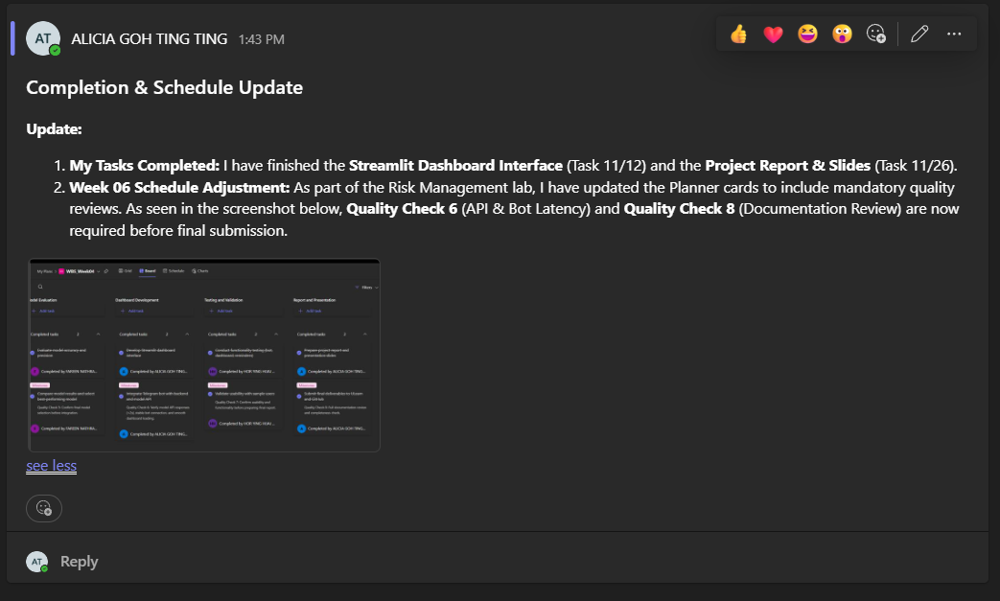
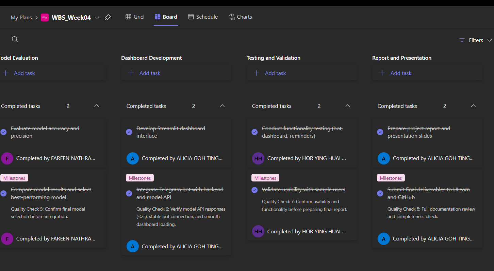

# AI To-Do List System

**Name:** Alicia Goh Ting Ting  
**Matric Number:** B032420018  
**Section:** S3G1  

**GitHub Repo:** [https://github.com/shawtygirlzzzz/AIPM-A4](https://github.com/shawtygirlzzzz/AIPM-A4)

---

## Reflection

### 1. Which quality criterion do you think will be hardest to achieve?
The hardest criterion to achieve is the **Intent Recognition Accuracy (≥ 90%)** because natural language is inherently unpredictable. Handling variations in slang, typos, and ambiguous phrasing requires a highly diverse dataset, which is difficult to gather within our tight timeline (Task 2.1). Without a massive volume of varied training data, consistently hitting that 90% benchmark across all user inputs will be our most significant technical hurdle.

### 2. Which risk poses the greatest threat to your project and why?
**Risk R2 (Intent model fails to reach 90% accuracy)** poses the greatest threat because it represents a single point of failure for the entire system; if the bot cannot understand commands, the backend features become inaccessible. With the highest risk score of 20 (Likelihood 4 × Impact 5), this technical bottleneck could render the product useless regardless of UI quality. Therefore, we have prioritized mitigation strategies like early dataset expansion to address this immediately.

### 3. How does quality management support project success?
Quality management shifts our focus from simply building features to ensuring reliability and user trust. By establishing strict gates, such as the "Entity Extraction F1-Score" and "2-second response time," we prevent wasted effort on broken builds and ensure the final product is actually usable. This proactive approach acts as a safety net, stopping us from progressing to integration phases until specific reliability standards are met.

---

## 4. MS Teams Announcements (Evidence)

**Announcement 1: Kick-off & Task Definition**
*Evidence of initializing the Week 06 Quality Management workflow.*

**Announcement 2: Completion & Schedule Update**
*Evidence of communicating task completion and notifying the team of new Quality Check requirements.*

---

## 5. Schedule Updates (Evidence)

**Evidence: Quality Checks in Planner**
*The screenshot below demonstrates how Quality Control measures (Check 6 & Check 8) were integrated directly into the Planner cards to enforce standards.*
